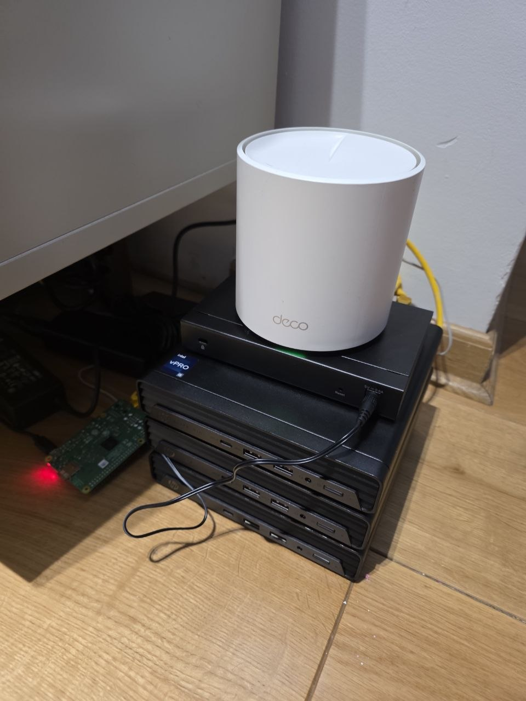

# homelab

Building a homelab out of spare hardware to learn production infrastructure end to end —
networking, clustering, Kubernetes, GitOps, observability — and to host agentic dev
tooling (Claude Code instances) off my main workstation.

The build is documented here as it happens: what exists, how it was set up, and which
decisions were made and why.

## The lab, v1.0



Three mini PCs, the switch, the mesh unit and the Pi, stacked on the floor and cabled
together. The 10″ rack is still printing. This photo gets replaced as the build changes,
and the one it replaces moves to [the lab over time](docs/history.md) — which is what the
version number is for.

## Hardware

| Device | Specs | Status |
|---|---|---|
| Laptop `node01` | i5-1240P · 16 GB RAM · 512 GB NVMe · Wi-Fi only — [details](docs/hardware.md) | retired, powered off. What it ran is in [the lab over time](docs/history.md) |
| Raspberry Pi 3B+ `exitnode` | 4× Cortex-A53 @ 1.4 GHz, 1 GB RAM — [details](docs/hardware.md) | in service: Pi-hole DNS, Tailscale exit node + subnet router, wired |
| 3× HP Elite Mini 600 G9 | i5-12500T · 16 GB DDR5 · 512 GB NVMe · 1 GbE — [details](docs/hardware.md) | in service: a three-node k3s cluster with replicated Ceph storage — [bring-up](docs/runbooks/node-bring-up.md) |
| Switch | TP-Link TL-SG108E, 8 × 1 GbE, web-managed — [details](docs/hardware.md) | in service: the wired backbone — [the network](docs/network.md) |
| Rack | 10″ 3D-printed — [KWS Rack V2](https://makerworld.com/en/models/2139130-kws-rack-v-2-heavy-duty-10-inch-homelab-rack) | printing |

## Where things run

- **node02, node03, node04** — k3s with embedded etcd, all three as servers,
  reconciled by Flux from `clusters/lab/`. Rook-Ceph runs an OSD on each and
  serves replicated block storage as the cluster's default StorageClass, with a
  CSI snapshot class on top of it. cert-manager and ingress-nginx,
  kube-prometheus-stack and Loki, Headlamp and Homepage, Vaultwarden, epicurus
  ([ADR 0007](docs/decisions/0007-epicurus-rebuilt-on-kubernetes.md)), and the
  agent pods: Claude Code Remote Control servers on volumes that follow the pod
  between nodes ([how](docs/runbooks/agent-pods.md), [how the nodes got
  here](docs/runbooks/node-bring-up.md)). Nightly restic backup of its volumes
  to object storage, taken from CSI snapshots so each one is atomic rather than
  crash-consistent ([how](clusters/lab/backup/README.md)).
- **exitnode** — Pi-hole answering DNS for the house (through the router's DHCP)
  and for the tailnet (through Tailscale's DNS override); Tailscale exit node and
  subnet router, so LAN-only things are reachable from anywhere on the tailnet
  ([how](docs/runbooks/pi-exitnode.md)). Also the lab's jump host and the sender
  for Wake-on-LAN, being the only always-on Linux box on the wired segment.
- **Workstation** — a client: `kubectl`, `flux`, git. Hosts nothing.

Every machine is wired to one managed switch; addressing, the port map and how
it is all reached from outside are in [the network](docs/network.md).

## Repo layout

```
clusters/           # Flux-reconciled Kubernetes manifests, one directory per component
  lab/              #   the node02-04 cluster
hosts/              # host-level config installed by hand, outside GitOps
  node01/backup/    #   the retired laptop's restic units, kept as a record
  exitnode/         #   the Pi: sshd hardening, forwarding sysctl, cloud-init guard, wake-nodes
  nodes/            #   node02-04, configured identically: netplan, cloud-init guard, sshd
images/
  claude-agent/     # container image for the Claude Code agent pods, built by GitHub Actions
docs/
  hardware.md       # hardware inventory and specs
  network.md        # addressing, the switch, how the lab is reached from outside
  history.md        # what the lab looked like before it looked like this
  decisions/        # architecture decision records (ADRs)
  runbooks/         # rebuilding things: disaster recovery, the Pi, the cluster nodes
```

## Principles

- Everything as code, GitOps where possible — if it's not in the repo, it doesn't exist.
- No secrets in the repo, ever. Encrypted (SOPS/age) once GitOps needs them.
- Docs updated in the same change that alters behavior, not later.
- Docs describe what exists and what was decided — not what might happen.
- Skills over convenience: choices favor what transfers to production work.
