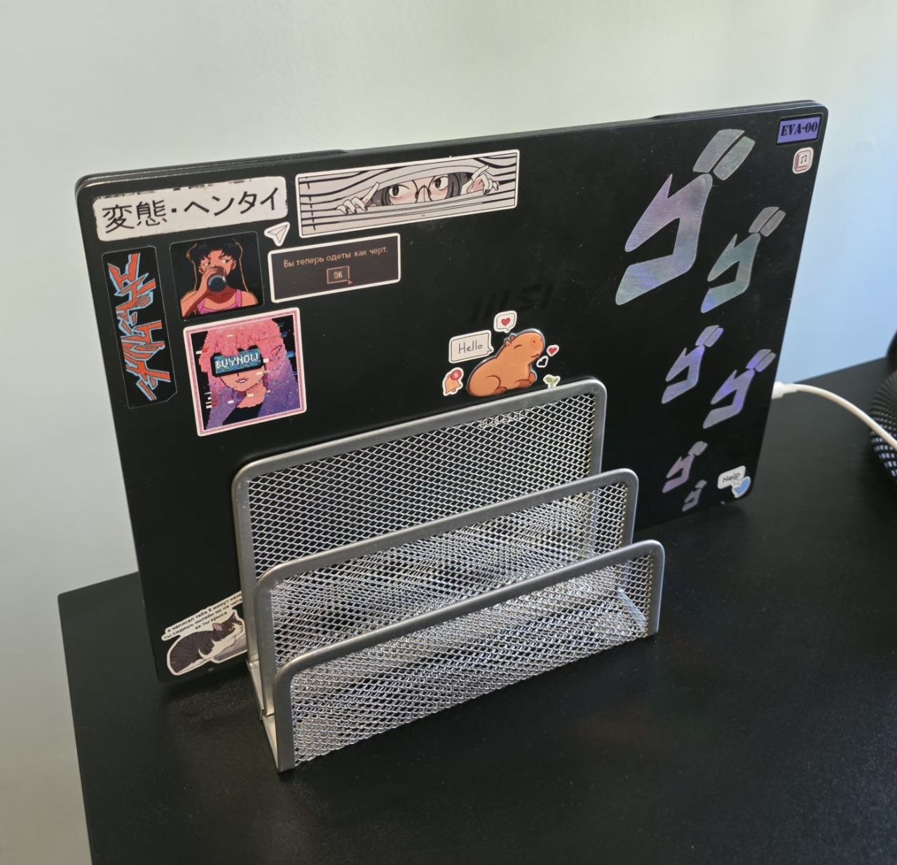

# The lab over time

The [README](../README.md) shows what the lab is now. This is what it was.

Newest first. A version number here is not a release — it is an excuse to keep a
photograph, and the bar for a new one is the build looking different enough that the old
picture has stopped being useful. When that happens the README's photo moves down here
and a new one takes its place up there.

Everything below is written in the past tense on purpose, even where the hardware is
still plugged in. The README is the only place that describes the present; if these two
ever disagree, the README is right and this file needs fixing.

## v0.1 — one laptop in a letter rack

Where it started: one laptop stood on edge in a wire letter rack so it ran with the lid
shut, on Wi-Fi, with nothing else on the LAN. k3s, Flux, cert-manager and ingress-nginx,
Prometheus and Loki, Headlamp, Homepage, Vaultwarden, the agent pods and two Incus
containers — all of it on that one machine, on one ext4 root filesystem, on one NVMe.

That last part is the reason most of the decisions from this period read the way they do.
With everything on a single disk, a dead NVMe took the operating system, the cluster and
every volume together, which is what [ADR 0004](decisions/0004-restic-to-object-storage.md)
exists to answer. With 16 GB of soldered memory and no upgrade path, what could be run at
all was a real constraint rather than a budgeting exercise —
[ADR 0003](decisions/0003-epicurus-compose-in-incus.md) turns on that number.

It is being emptied rather than switched off in one go: the workloads move to the
three-node cluster one at a time, each cutting over by gaining a DNS record of its own,
so that a rollback is deleting one record. The machine goes dark at the end of that.
